#                                                   英语学习

## 动词分类

### 五大句型

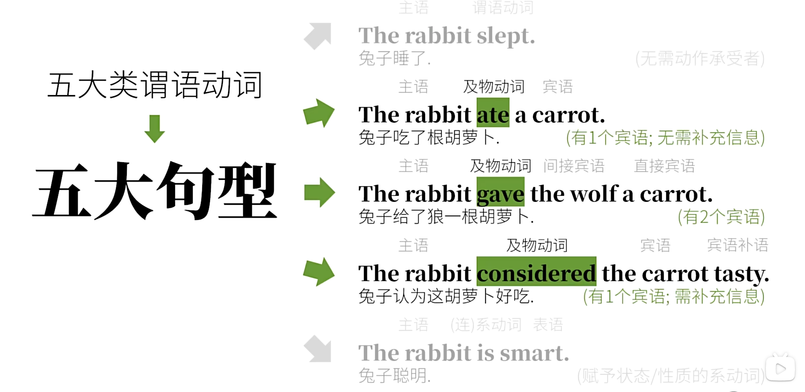

### 实际分类

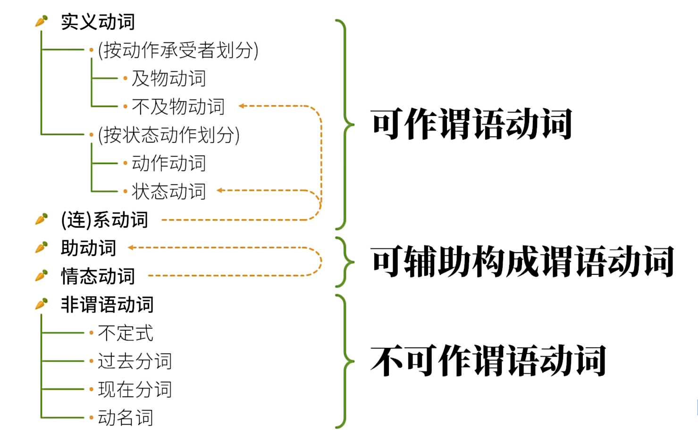

## 英语时态

### 一般现在时

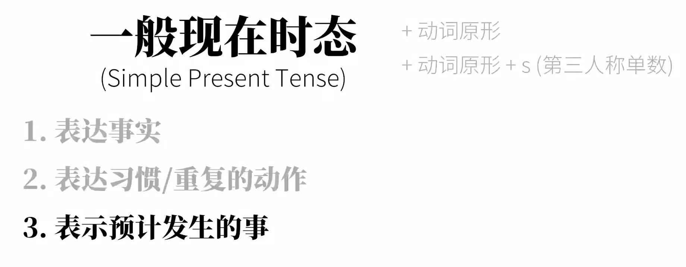

#### 1.表达事实

The rabbit eats carrots.兔子吃胡萝卜

#### 2.表达习惯/重复的动作

I play basketball.我打篮球(我有这个习惯)

#### 3.表示预计发生的事情

The bug leaves at 8PM every day.

### 现在进行时态

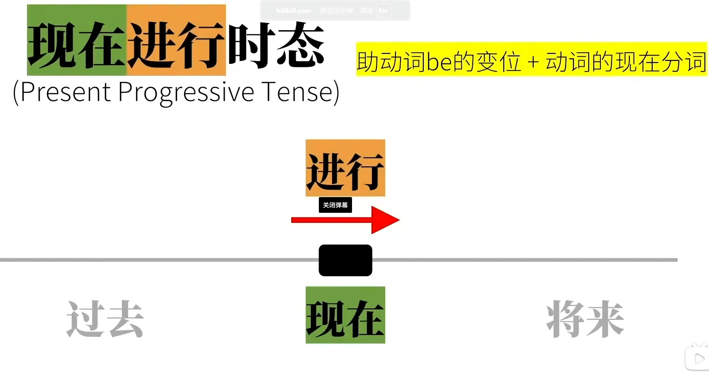

####  be

1. 系动词
   I am a smart rabbit =>I = a smart rabbit （把后面的赋值给前面）
2. 助动词，构成时态

#### 现在分词

通常:+ing
write=wirting
hit=hitting
die=dying

### 现在完成时态

往往对现在还造成影响，例:我已经吃掉了，胡萝卜(暗示),现在没得吃了

#### have

1. 实义动词
   I have some coins for this video.
   我有些硬币给这个视频

2. 助动词，构成时态

   I/you/wen/they have
   She/he/it has

#### 过去分词

通常:+ed
eat=eaten
bring=brought
feel=felt

### 现在完成进行时态

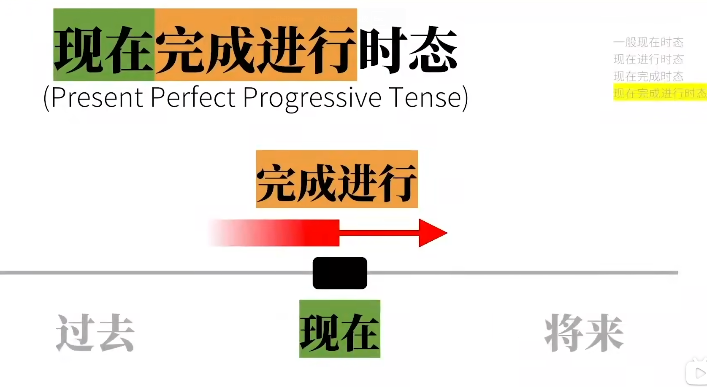

对于现在这个时间点，不仅完成了部分还要一直进行下去

#### 构成

have的变位+been+现在分词
I have been eating a carrot.

### 一般过去时态

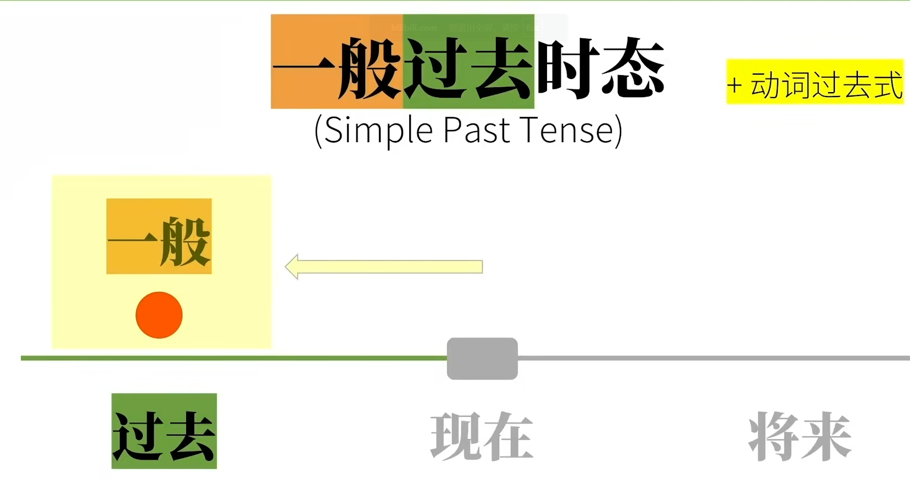

I/you/we/she/he/it/they ate a carrot yesterday.

#### 过去式

通常:+ed
如:looked,samlled,tasted...

想要表示过去的习惯，需要使用used to do stn
I used to play basketball.我过去尝尝打篮球.

### 过去进行时态

#### 变位

I/she/he/it was
You/They/we were

 

### 过去完成时态

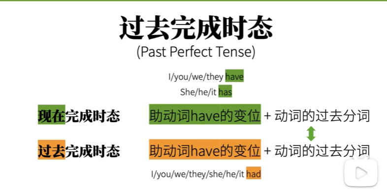

#### 助动词have的变位＋动词的过去分词

I/you/we/they/she/he/it had

### 过去完成进行时态

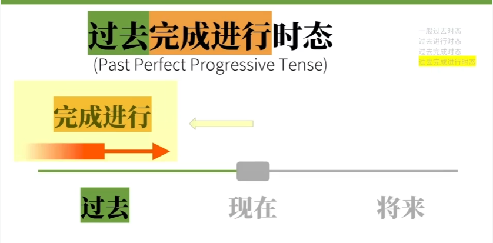

对于过去某个点，不仅完成了某些，还要继续完成下去

#### had been 动词的现在分词

### 将来时态

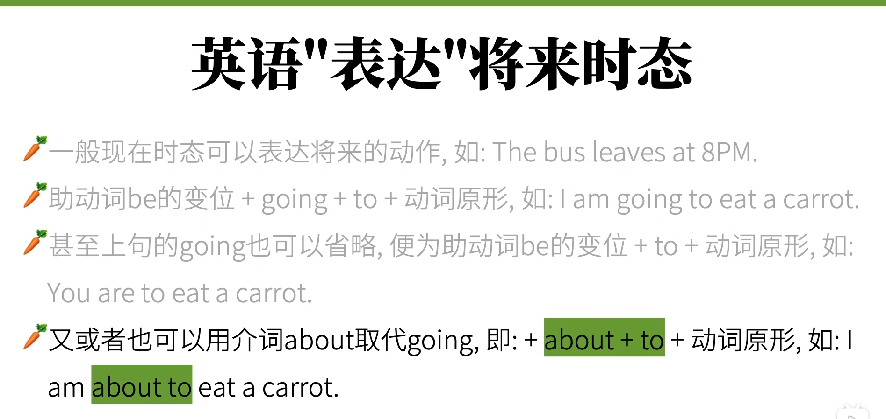

### 一般将来时态

 

will + eat

助动词+动词原形

### 将来进行时态

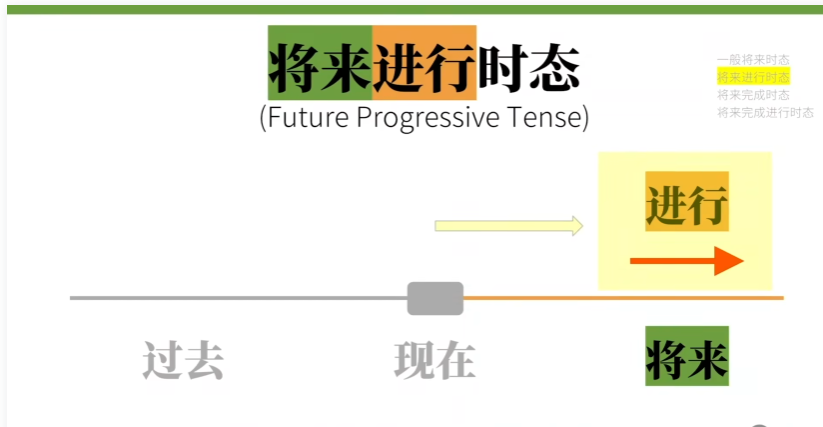

#### 变位

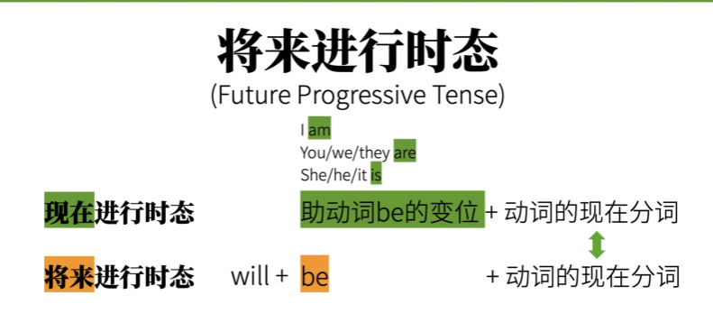

####  用法

确保将来会发生可以使用

### 将来完成时态

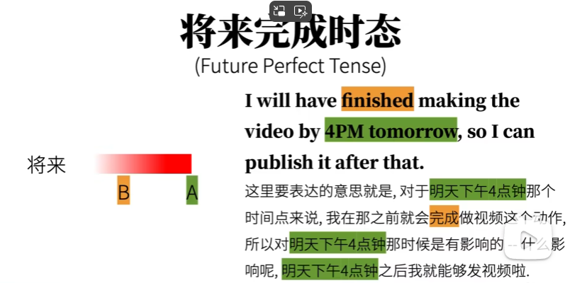

### 将来完成时态

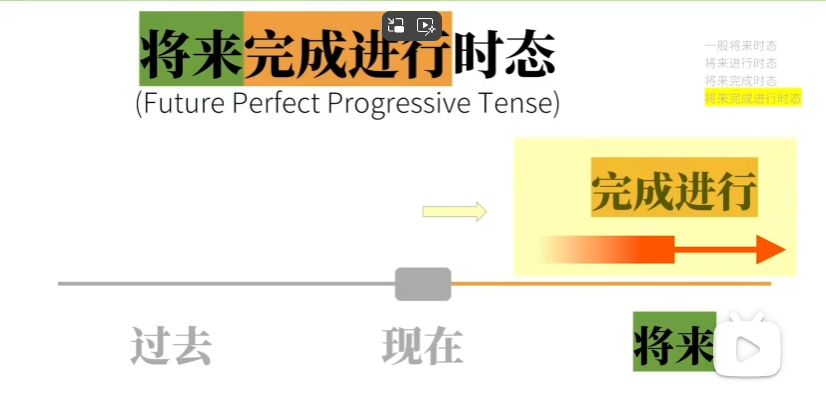

#### 变位 

will + have + been + 现在分词

### Would多义

### 变位总结

## 动词语气

### 语气分类 

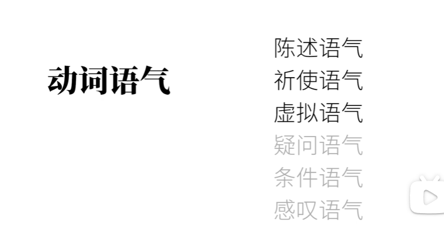

### 陈述语气

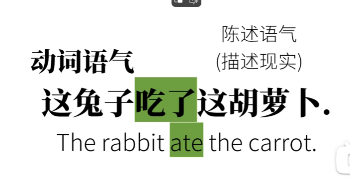

### 祈使语气

### 虚拟语气

## 非谓语动词

## 独立主格

## 助动词&情态动词

## 系动词

## 使役动词

## 从句

## 冠词

## 介词

## 名词

## 代词

## 数词

## 形容词

## 副词

## 连词

## 叹词

## 限定词

## 构词法

## 句子成分&分类

## 被动

## 倒装

## 强调

## 省略

## 主谓一致

## 英文标点

